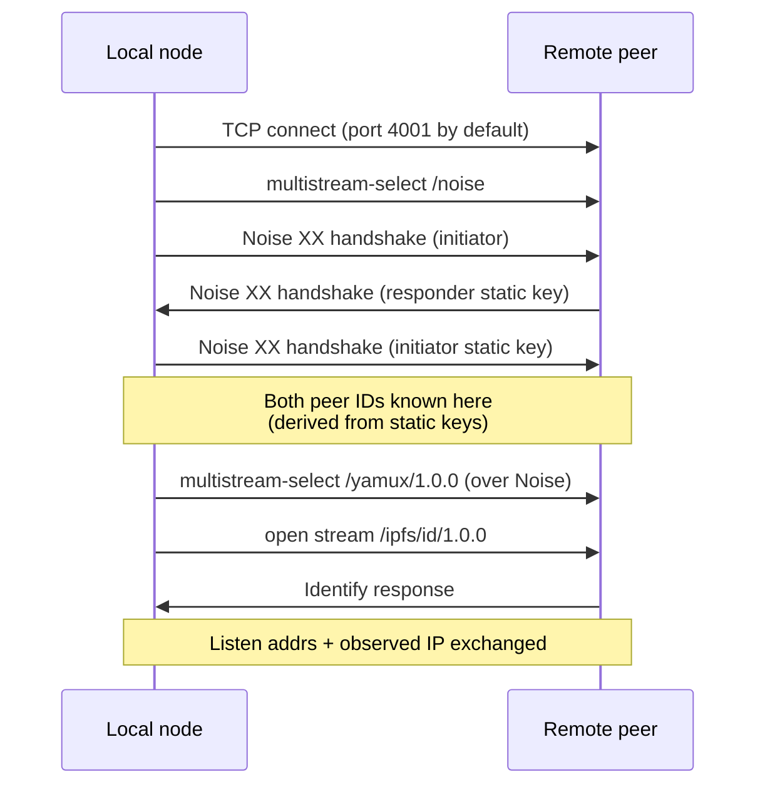

# Peer Discovery

This document explains how kademlite peers find each other, from
process startup through long-running operation. The goal is not to
re-derive Kademlia, but to make the kademlite-specific choices
(transports, providers, fallbacks, eviction) precise enough that you
can reason about any deployment shape: a single host, a SLURM job, a
K8s deployment, or a manual cluster.

## Two phases, not one

Discovery is split into a finite **bootstrap** phase and a continuous
**self-organization** phase.

Bootstrap is a seeding step. Its only job is to land a small number
of working connections so the rest of the DHT can be discovered
through Kademlia itself. Bootstrap does not, and is not expected to,
enumerate the whole cluster. It dials a bounded list of candidates
(`K=20`) and stops.

Self-organization runs forever after that. As soon as bootstrap
deposits any peers in the routing table, the node runs an iterative
`FIND_NODE` for its own peer ID. That walk pulls in the
network-neighborhood peers, fills the routing table's K-buckets, and
gives the node enough structure to participate in the DHT. From there
on, every PUT, GET, and lookup contributes to the same routing
information, and a periodic maintenance loop keeps things healthy.

This is the standard Kademlia model. The thing worth being precise
about is that bootstrap is the seed, not the discovery.

## Bootstrap providers

There are four ways to seed bootstrap. They are evaluated in this
order, all of them are run if configured, and they accumulate into
the same dial set:

| Provider | Configured by | Typical use |
|---|---|---|
| Explicit multiaddrs | `bootstrap_peers=[...]` | Manual cluster, known peers |
| DNS | `bootstrap_dns="..."` | K8s headless services |
| SLURM | `bootstrap_slurm="..."` or `SLURM_JOB_NODELIST` env | HPC jobs |
| mDNS | `enable_mdns=True` (auto when nothing else) | Single LAN, dev |

mDNS is the only provider with auto-enable behavior: if none of the
other three are configured, mDNS turns on by default. If any of the
other three are configured, mDNS stays off unless explicitly
requested. The intent is "do something sensible when given no
configuration at all, but stay out of the way otherwise."

## The per-peer dial flow

Every bootstrap path eventually feeds candidate IPs into the same
dial machinery. The sequence per candidate is:



Concretely:

- **Transport**: plain TCP. No QUIC, no WebSocket.
- **Security**: Noise XX with the libp2p suite
  `Noise_XX_25519_ChaChaPoly_SHA256` (X25519 DH, ChaCha20-Poly1305,
  SHA-256). The XX pattern exchanges static keys on both sides, so
  each peer learns the other's static public key as part of the
  handshake. Peer ID is the libp2p multihash of that public key, so
  it is implicit in the handshake. There is no separate "peer ID
  exchange."
- **Multiplexing**: Yamux (`/yamux/1.0.0`) over the Noise-encrypted
  TCP stream. Subsequent protocols (Kademlia, Identify) ride on Yamux
  streams.
- **Identify**: `/ipfs/id/1.0.0` is opened immediately after the
  Yamux session is up. The response carries the remote's listen
  addresses, supported protocols, agent version, and the address it
  observed for *us*. Listen addresses go into the routing table,
  replacing the dial-time address (which was just the bootstrap
  candidate IP). The observed address feeds the IP voting described
  below.

After all bootstrap dials have run, the node performs one iterative
`FIND_NODE(self.peer_id)`. That call is what actually populates the
K-buckets beyond the bootstrap seeds.

## Why bounded

The DNS, SLURM, and mDNS providers all funnel through `_dial_ips`,
which has two bounding parameters:

- **`max_concurrent = 20`**: a semaphore that limits how many dials
  run in parallel.
- **`K = 20`**: a hard early-exit. Once 20 successful connections
  land, remaining dials are skipped (the coroutine returns without
  attempting the connect).

These are intentional. K is the Kademlia k-bucket size; once we have
K well-distributed peers, the routing table has enough material to do
real iterative lookups, and additional bootstrap dials are pure cost.
At a 200-pod K8s deployment, a freshly started peer connects to up to
20 resolved neighbors, then learns about the remaining ~180 through
Kademlia FIND_NODE traffic. No single peer ever holds connections to
all the others, and that is by design.

`_dial_ips` also filters self-IPs: both the configured listen
address and the currently observed IP are removed from the candidate
list before dialing.

## DNS provider in detail

`bootstrap_dns="kdl-dht.dht-test.svc.cluster.local"` causes startup
to call `socket.getaddrinfo(hostname, port, type=SOCK_STREAM)` and
feed the deduplicated IP list into `_dial_ips`. K8s headless Services
return one A record per Ready endpoint, so the resolved set is the
set of currently-Ready peer pods.

Two realities to be aware of at scale:

- **DNS UDP truncation**. Standard DNS responses ride in 512-byte UDP
  packets. At ~28-30 IPs the response truncates and the resolver is
  expected to retry over TCP. Glibc's resolver and Python's
  `getaddrinfo` honor this fallback. Some lightweight resolvers do
  not: the manifest's init container uses `busybox nslookup`, which
  is UDP-only and reports only the truncated set, so its `MIN_PEERS`
  count is conservative for that reason.
- **Endpoints readiness gating**. The Kubernetes Endpoints object
  driving the headless Service includes only Ready pods (those that
  have passed the `tcpSocket: 4001` readiness probe in our manifest).
  Pods that are still starting up are not in the resolved set even
  though `kubectl get pods` shows them.

Neither matters for correctness in practice: as soon as the local
peer lands K connections, it stops dialing, runs the self-lookup, and
discovers the full topology through Kademlia.

## SLURM provider in detail

`bootstrap_slurm="gpu[01-08],cpu[1-3]"` (or the `SLURM_JOB_NODELIST`
environment variable, set automatically inside SLURM jobs) is
expanded into individual hostnames by `expand_hostlist`, then each
hostname is resolved via `getaddrinfo` and fed into `_dial_ips`.

Supported syntactic forms:

- Comma-separated lists: `host1,host2,host3`
- Numeric ranges with zero-padding: `node[01-04]` ->
  `node01, node02, node03, node04`
- Bracket lists: `gpu[1,3,5]` -> `gpu1, gpu3, gpu5`
- Mixed: `gpu[1-3,5]`
- Cartesian product across multiple bracket groups:
  `rack[1-2]-node[01-02]` -> `rack1-node01, rack1-node02,
  rack2-node01, rack2-node02`

Not supported:

- Exclusion ranges (`[1-10^5]`)
- Stepped ranges (`[1-10:2]`)
- Nested brackets

If you need any of those, expand them yourself before passing the
list in.

## mDNS provider in detail

mDNS is a single-LAN convenience provider. It is wire-compatible with
the libp2p mDNS discovery service:

- **Multicast**: 224.0.0.251:5353 over UDP, IPv4 only. No IPv6
  multicast support.
- **Service name**: `_p2p._udp.local`. Peers announce a PTR record
  pointing at a per-instance name and attach a TXT record with
  `dnsaddr=` entries containing their multiaddrs.
- **Query cadence**: an initial query fires immediately, followed by
  exponential backoff starting at 0.5s and doubling each cycle until
  it caps at the steady-state interval (default 300s).
- **TTL**: 360 seconds on records by default.
- **Self filter**: the local peer ID is excluded from any responses
  the node receives.

mDNS is appropriate for development on a single switch and small
in-house clusters. It is not appropriate for multi-rack data center
fabrics (multicast is typically not routed), most K8s clusters
(multicast is normally not delivered between pods), or SLURM jobs
that span racks. If you are deploying in any of those, configure DNS
or SLURM bootstrap and let mDNS auto-disable.

## Identify exchange

The Identify protocol is part of every successful bootstrap dial and
is also re-run when a peer pushes an update (`/ipfs/id/push/1.0.0`).
Each Identify response contains:

| Field | Contents |
|---|---|
| `publicKey` | libp2p-encoded Ed25519 public key |
| `listenAddrs` | binary multiaddrs the peer is listening on |
| `observedAddr` | binary multiaddr of how the remote sees us |
| `protocols` | list of protocol IDs the remote supports |
| `protocolVersion` | default `ipfs/0.1.0` |
| `agentVersion` | default `kademlite/0.1.0` |

The two practical consequences:

- **Real listen addresses replace dial-time addresses.** A peer might
  have been dialed on a NAT'd or pod IP; Identify is what tells us
  what the peer thinks its real listen addresses are. Those replace
  the dial-time entry in both the routing table and the peer store.
- **Observed-IP voting**. When we bind to `0.0.0.0`, we do not yet
  know our own routable IP. Each remote peer reports the IP it sees
  us at via `observedAddr`. Once `_observed_ip_threshold` distinct
  peers report the same IP, we accept it as our own and update our
  advertised listen addresses, then push the update to all connected
  peers via `/ipfs/id/push/1.0.0`.
- **Default threshold**: 2 distinct peers in production. The K8s test
  runner sets it to 1 because some scenarios start with a single
  bootstrap peer.

## Maintenance loops

Once bootstrap is done, two periodic loops keep the routing table
honest.

**Bootstrap maintenance** runs every 5 minutes:

- If the routing table has dropped below `K` peers, all configured
  bootstrap providers are re-run (DNS re-resolved, SLURM re-resolved,
  mDNS re-queried, explicit peers re-dialed).
- A self-lookup (`FIND_NODE(self.peer_id)`) runs unconditionally,
  refreshing the local neighborhood.
- Each non-empty K-bucket is "refreshed" by picking a random peer ID
  at that bucket's distance and running iterative lookup against it.
  This pulls in fresh peers across the keyspace, not just nearby.

**Republish maintenance** runs every `republish_interval` (default 1
hour):

- Originated records are re-published to keep them alive past TTL.
- A full prune sweeps the routing table for peers with dead Yamux
  sessions or `connected=False` entries with no live connection.

## Connection close and eviction

When a remote peer goes away (pod restart, host failure, network
blip), Yamux detects the close (GO_AWAY frame, EOF, or socket error)
and marks its session dead. The routing table does not learn this
directly, but the next RPC against that peer fails, which triggers
`routing_table.mark_disconnected(peer_id)`. From that point:

- `_is_peer_reachable()` returns False for the entry, so iterative
  lookups skip it.
- The next light prune (`_quick_prune`, runs at the start of each
  bootstrap-maintenance cycle, every 5 minutes) removes the entry if
  no live connection has reappeared.
- The next full prune (in the republish loop, hourly by default)
  catches anything missed.

The asymmetry between mark-disconnected (immediate, on RPC failure)
and full removal (periodic) means the routing table tolerates brief
network glitches without churning, while still cleaning up genuine
departures within minutes.

## Multiaddrs

Throughout the codebase, peer addresses are libp2p multiaddrs in the
form:

```
/ip4/<addr>/tcp/<port>/p2p/<base58-encoded-peer-id>
```

The bootstrap layer accepts this string form via `bootstrap_peers`.
Internally, addresses are kept as the binary multiaddr encoding,
which is what Identify exchanges over the wire and what the peer
store and routing table store. The multiaddr functions in
`kademlite/multiaddr.py` handle the conversion both ways.

## Constants worth knowing

| Constant | Value | Where |
|---|---|---|
| `K` (k-bucket size) | 20 | `routing.py` |
| Bootstrap dial concurrency | 20 | `dht_bootstrap.py` |
| `BOOTSTRAP_INTERVAL` | 300 s | `dht_maintenance.py` |
| `republish_interval` (default) | 3600 s | `dht.py` |
| Default port (in K8s manifest) | 4001 | `tests/k8s/k8s-dht-test.yaml` |
| Default `_observed_ip_threshold` | 2 | `dht.py` |
| Kademlia protocol ID | `/ipfs/kad/1.0.0` | `kademlia.py` |
| Identify protocol ID | `/ipfs/id/1.0.0` | `connection.py` |
| Identify push protocol ID | `/ipfs/id/push/1.0.0` | `connection.py` |
